<p align="center">
  
</p>


# 趣玩星球 FunPlanet (Flutter项目)

原创作者：黄恒鑫

面向潮玩爱好者的 Flutter 移动电商 App，含商城购物、会员体系、AI 助手「小豆」、AI 绘画、AI 社区与在线客服。配套 Node.js 后端、React 管理后台与 PostgreSQL 数据库，已完成 Android Release 打包与云服务器部署。

| 模块 | 技术 | 说明 |
|------|------|------|
| 移动端框架 | Flutter | 跨平台移动应用开发框架 |
| 移动端语言 | Dart | Flutter 官方编程语言 |
| 后端运行环境 | Node.js | JavaScript 运行时环境 |
| 后端框架 | Express | Node.js Web 应用框架 |
| 后端语言 | JavaScript | 服务器端编程语言 |
| 管理员后台框架 | React | 前端 UI 框架 |
| 管理员后台语言 | TypeScript | 类型安全的 JavaScript 超集 |
| 数据库 | PostgreSQL | 关系型数据库 |
| ORM | Prisma | 后端与数据库之间的对象关系映射 |

[](https://github.com/Luokey-cmd/FunPlanet/releases)

---

## 特别说明

本仓库为 **开源代码 + 在线体验** 的组合形式，使用前请了解以下事项：

**关于在线体验**

本项目已由作者 **自行购买云服务器并完成部署**，后端接入了 **DeepSeek、通义万相** 等多个 AI 大模型 API。Release 提供的 Android 安装包可直接使用，支持 **注册登录、AI 对话、AI 生图** 等完整功能。如需体验手机 App，请参阅下方 **[快速体验](#快速体验)** 章节。

**关于源码获取**

如需阅读或复用代码，可下载 Release 中的 **Source code (zip / tar.gz)**，或克隆本仓库。仓库内包含 **Flutter 客户端、Node.js 后端、React 管理后台** 的完整前后端源码。

**关于未开源部分**

出于安全与成本考虑，以下内容 **未随仓库公开**：

- 云服务器实例及部署环境
- 数据库连接信息、JWT 密钥等运行时配置（`.env`）
- 各 AI 大模型的 API Key 及调用额度

因此，克隆或下载源码后 **无法直接复现作者当前的线上运行效果**，仍需自行 **购买并配置云服务器**、**申请并接入 AI 模型 API**、**填写环境变量并完成部署**，方可搭建独立可用的完整系统。

**关于代码用途**

本仓库代码仅供 **学习、参考与二次开发复用**。欢迎在理解上述前提的基础上 fork、修改与扩展；若用于生产环境，请使用您自己的服务器与 API 凭证，并遵守各 AI 服务商的使用条款。

---

## 快速体验

无需编译源码，按以下步骤在 Android 手机上安装并使用 **趣玩星球**。

### 一、下载并安装 APK

#### 步骤 1 · 打开 Release 页面

进入 GitHub 仓库，在右侧 **Releases** 区域点击最新版本 **趣玩星球 v1.0.0**。**[→ 前往 Releases 下载 APK](https://github.com/Luokey-cmd/FunPlanet/releases)**

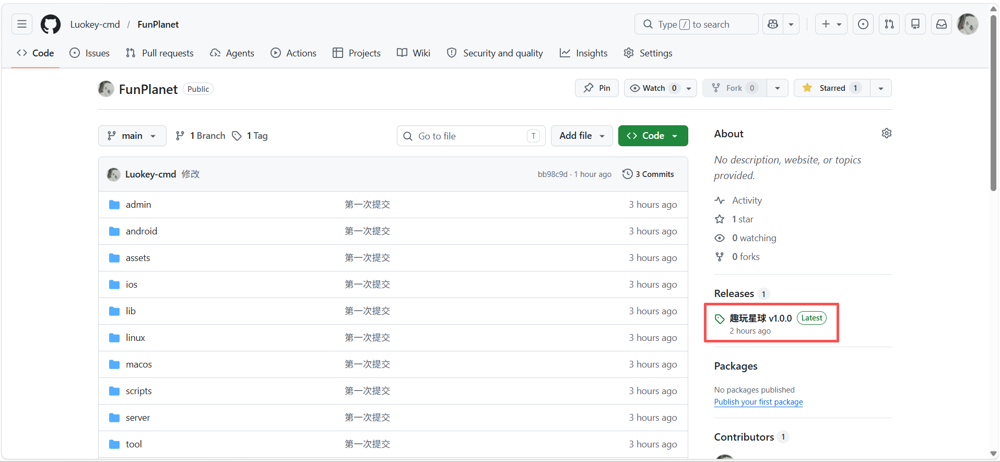

#### 步骤 2 · 下载 APK

在 Release 页面底部 **Assets** 区域，点击 **`FunPlanet-v1.0.0.apk`** 下载（约 172 MB）。下方两个 Source code 为 GitHub 自动附带的源码包，体验 App **只需下载 APK**。

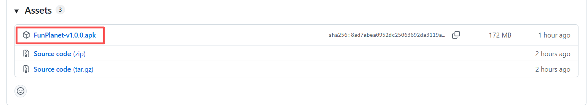

#### 步骤 3 · 发送到手机（微信文件传输助手）

在电脑上打开 **微信 → 文件传输助手**，将下载好的 `FunPlanet-v1.0.0.apk` 拖入对话框并发送。也可先发到自己的微信，再在手机上接收。

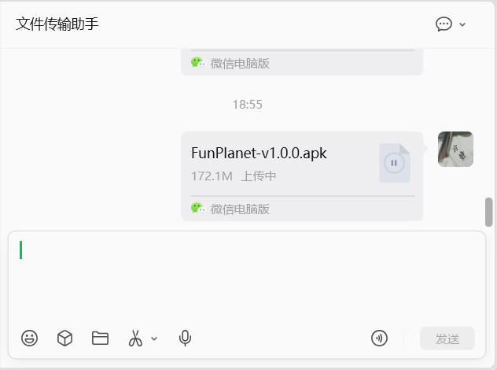

#### 步骤 4 · 在手机上保存文件

手机微信中点开该文件，在弹出菜单中选择 **「保存」**，将 APK 保存到本机存储。

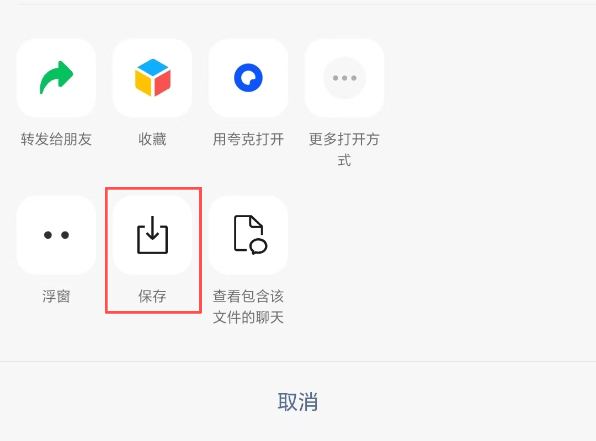

#### 步骤 5 · 在文件管理器中安装

打开手机的 **文件管理器 → 最近**，找到 `FunPlanet-v1.0.0.apk`（来源可能显示为「微信」），点击文件开始安装。

- 若文件名带有 **`.apk.1`** 后缀，请先 **重命名** 为 `FunPlanet-v1.0.0.apk` 再安装
- 若提示「禁止安装未知应用」，请在系统设置中允许 **文件管理器** 或 **微信** 安装未知来源应用

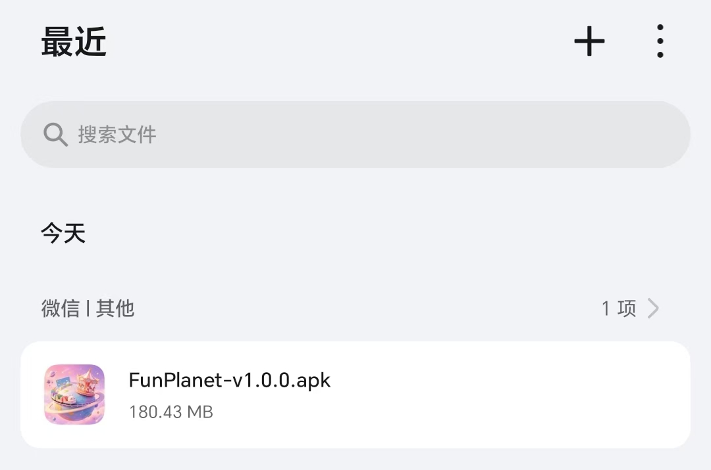

---

### 二、注册账号

#### 步骤 6 · 创建账号

首次打开 App 需 **联网**。点击 **注册**，填写昵称、手机号、密码（至少 6 位），勾选用户协议后完成注册。注册成功后可领取新人优惠券。

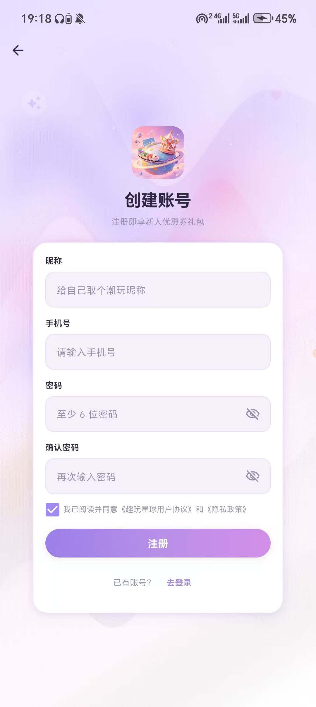

---

### 三、体验 App 功能

安装并登录后，App 会自动连接云服务器 `http://8.134.249.51:3000`，以下功能均可在线体验。

#### 步骤 7 · 首页浏览

底部 Tab 切换 **首页 / 商城 / 购物车 / 我的**。首页可浏览分类、Banner、每日任务、会员福利与趣玩市集商品。

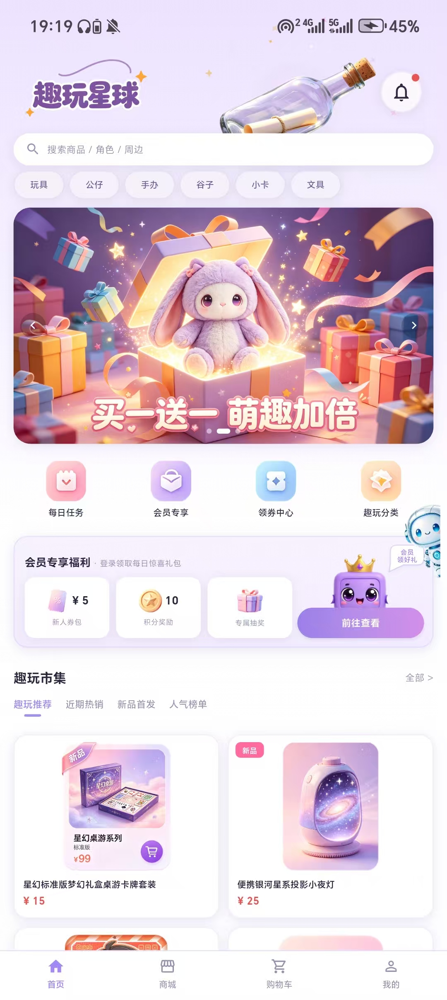

#### 步骤 8 · 商品详情

在首页或商城点击商品，进入 **商品详情** 页，可查看主图、价格、分类标签与商品介绍；支持收藏、分享，以及 **加入购物车 / 立即购买**，也可联系客服。

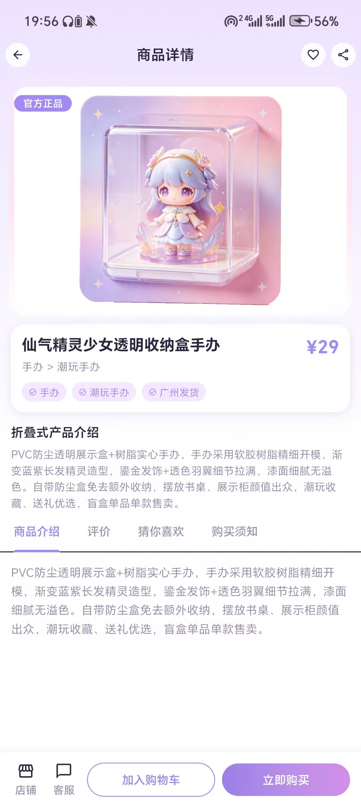

#### 步骤 9 · 小豆 AI 对话（商品推荐）

点击首页悬浮 AI 助手或进入 **小豆** 聊天页，可自然语言对话。例如输入「帮我买个小夜灯」，AI 会推荐商品并展示卡片，支持 **加入购物车 / 立即购买**。

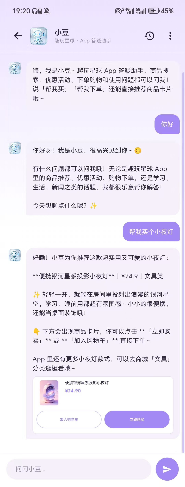

#### 步骤 10 · 小豆 AI 答疑

小豆还可回答 App 内活动、优惠、会员等问题，例如「今天 APP 里面有什么活动吗」。

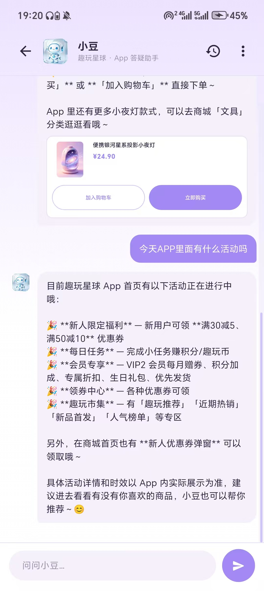

#### 步骤 11 · 我的（会员 / 订单 / 服务）

在 **我的** 页面查看积分、趣玩币、优惠券与 VIP 会员权益；管理订单、地址、收藏；入口可进入 **AI 绘画** 与 **AI 社区**。

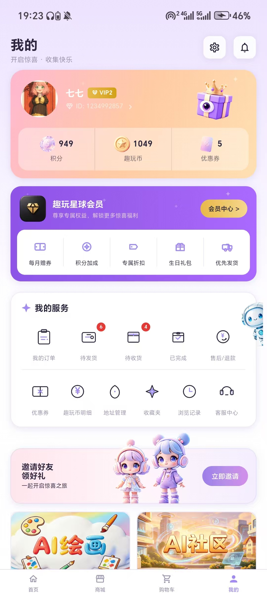

#### 步骤 12 · AI 绘画

输入描述词、选择绘画风格，点击 **开始创作**。生成结果可查看大图、再次生成或 **保存到本地**（数据同步云端）。

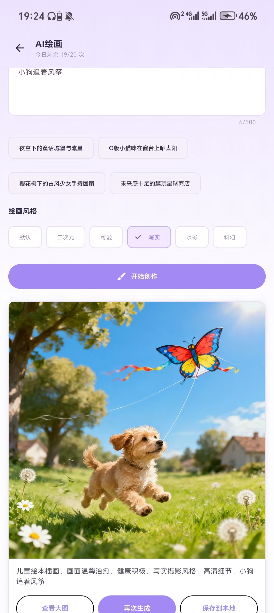

#### 步骤 13 · AI 社区

浏览 AI 好友与用户动态，支持点赞、评论，也可点击 **发动态** 发布图文帖子。可以看到所有用户在AI社区发布的动态，同时有AI社区有八个AI虚拟朋友会在各用户的动态下点赞评论，也会有AI虚拟朋友发送动态在AI社区中。

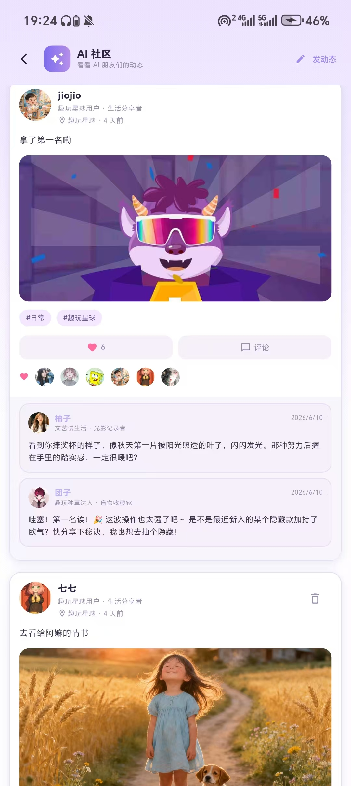

---

## 主要功能

- **首页 / 商城** — 商品浏览、分类、搜索、Banner 轮播
- **购物车 / 订单** — 加购、结算、地址管理、优惠券
- **我的** — 积分、趣玩币、会员、收藏、浏览记录
- **小豆 AI** — 流式对话助手，支持对话中推荐商品卡片
- **AI 绘画** — 文生图，作品保存至云端
- **AI 社区** — 发帖、互动
- **在线客服** — 实时聊天，支持图片消息

---

## 管理后台

项目包含 **React 管理后台**（`admin/`），供运营人员在浏览器端管理 App 数据。需本地或服务器启动后端与后台服务后访问（开发环境默认如 `http://localhost:5173`）。

- **数据看板** — 总营收、订单数、注册用户、商品总数及趋势图表
- **营收分析** — 付费订单与分类营收统计
- **商品管理** — 商品增删改、图片上传、价格库存
- **订单管理** — 订单筛选、发货、确认送达
- **用户管理** — 注册用户查看与管理
- **优惠券 / 轮播图** — 营销活动与首页 Banner 配置
- **客服中心** — 在线回复 App 用户咨询
- **更新日志 / 系统设置** — 版本说明与后台配置

### 数据看板

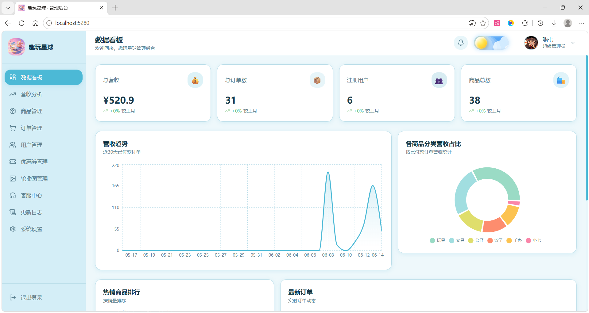

### 订单管理

App 端下单后，订单会同步至管理后台，可进行发货与状态管理。

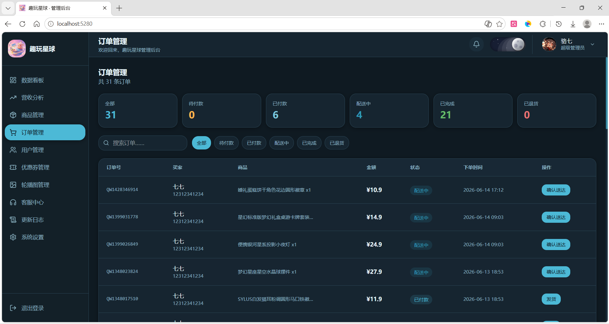

---

## 云服务器与数据

Release APK **已关联作者部署的云服务器**，以下数据会同步至云端：

- 账号（注册 / 登录）
- 购物车、订单、地址、收藏、优惠券、个人资料
- 用户头像、评价图片、AI 社区图片、客服聊天图片
- AI 绘画生成结果

演示数据保存在作者服务器，与 GitHub 源码仓库无关，仅供开源体验，不保证长期稳定或数据永久保留。

---

## AI 模型

| 功能 | 模型 | 服务 |
|------|------|------|
| AI 对话（小豆、AI 社区等） | **DeepSeek `deepseek-chat`** | [DeepSeek API](https://api.deepseek.com) |
| AI 生图 | **通义万相 `wan2.6-t2i`** | [阿里云 DashScope 万相](https://dashscope.aliyuncs.com) |

AI 能力由服务端统一调用，App 内不包含 API Key。

---

## 技术栈

| 模块 | 技术 |
|------|------|
| 移动端 | Flutter, Dart, Provider, http |
| 后端 | Node.js, Express, Prisma, PostgreSQL, JWT |
| 管理后台 | React, Vite, TypeScript |
| 部署 | Docker, Docker Compose |
| AI | DeepSeek API, 通义万相 Wanx |

---

## 项目结构

```
funplanet/
├── lib/              # Flutter 客户端源码
├── android/          # Android 工程
├── assets/           # 静态资源（商品图、Banner 等）
├── server/           # Node.js API + Prisma 数据库
├── admin/            # React 管理后台
├── scripts/          # 打包、部署脚本
├── docker-compose.yml
└── 开源说明-未上传GitHub的文件.txt
```

---

## 本地开发

### 环境要求

- Flutter SDK（Dart ^3.12）
- Node.js 18+
- PostgreSQL（或 Docker）

### 1. 后端

```bash
cp .env.example .env
# 编辑 .env，填写 DATABASE_URL、JWT_SECRET、DEEPSEEK_API_KEY 等

cd server
npm install
npx prisma migrate deploy
node prisma/seed.js
npm run dev
```

API 默认运行在 `http://127.0.0.1:3000`。

### 2. Flutter App

```bash
flutter pub get
flutter run
```

Debug 模式下 App 会自动尝试连接本机 / 模拟器后端（见 `lib/config/api_config.dart`）。

### 3. 管理后台（可选）

```bash
cp admin/.env.example admin/.env
cd admin
npm install
npm run dev
```

### 4. Docker 一键部署（生产）

```bash
cp .env.production.example .env
# 填写 POSTGRES_PASSWORD、JWT_SECRET 等
docker compose up -d --build
```

---

## 打包 Release APK

```bash
flutter build apk --release --dart-define=API_BASE_URL=http://你的服务器:3000
```

产物路径：`build/app/outputs/flutter-apk/app-release.apk`

线上 API 地址也可配置在 `lib/config/production_api_host.dart`。

---

## 开源说明

仓库中 **故意未包含** 部分文件（如 `.env`、密钥、`node_modules`、构建产物等），详见：

**[开源说明-未上传GitHub的文件.txt](./开源说明-未上传GitHub的文件.txt)**

克隆后若缺少上述文件，属预期行为，并非仓库不完整。

---

## 相关链接

- **Release 安装包**：https://github.com/Luokey-cmd/FunPlanet/releases
- **问题反馈**：https://github.com/Luokey-cmd/FunPlanet/issues

---

## License

暂未指定开源协议。如需参加竞赛或商用，请先通过 Issues 联系作者luoqiwenju@qq.com。

